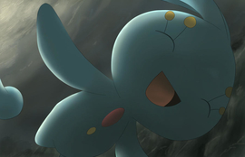

# MKS22X-FinalProject: BERRY CONQUEST
  Welcome to our final project! We've developed a game based off *[Bad Ice Cream](https://www.crazygames.com/game/bad-ice-cream)*, but with an unique twist: we've added Pokémon to it! This project was created by [Amanda Zheng](https://github.com/Agent-Coder) and [Justin Chen](https://github.com/jcmmii) over the span of about three weeks, so it while it may not contain as many features as the original game, we hope that the game is still enjoyable nonetheless. 

-------

## Project Description:
The player chooses one of the three Pokémon to play as: Manaphy, Empoleon, or Glaceon. The objective is to go through each level and attempt to get all the berries without being attacked by various enemy Pokémon or dying to various obstacles. If an enemy comes in contact with the player, the player will have to restart the level. Players will have to navigate through not only enemies but obstacles scattered throughout each level. Players will also have the ability to create ice blocks as obstacles for enemies. However, those ice blocks can become obstacles for the players if they trap themselves. Some enemies can break/go through ice blocks to try to get to the player. The player beats the game once they've completed all 4 levels. 
  
## Directions:
Controls: 
```
- Arrow keys for movement
- P keyboard button to pause on any level
- Space bar generates an ice attack (but be careful! you can't move while attacking)
```

1. Download our repo, files, and Processing (if you don't have it already).
2. Click run/play on the upper left side once you've downloaded everything, and opened up LevelEditor/LevelEditor.pde
3. Press play, bringing you to the level&character select screen. Be sure to choose both a level and a Pokemon (Manaphy, Empoleon, or Glaceon) for the GO button to appear, bringing you into the game. Because our game is relatively short, you have access to all four levels from the start, but its recommended you start from level 1!
4. Move around using arrow keys, press space bar to generate ice blocks (in a row, be careful, you can't move at all while attacking). Your objective? *Grab all the berries on the screen without getting killed by enemies* You can't kill enemies! You just have to keep on running to grab all the berries while avoiding enemies. *Any* contact with enemy Pokemon will result in death, forcing you to restart the level :(
5. In level 3, Mismagius is a ghost type Pokemon, enabling her to pass through the crystals. As a non-ghost type Pokemon, you can't pass through the crystals. Your goal is to get all the berries while avoiding Mismagius and dodging all the crystals that pop up from the ground every couple of seconds.
6. In level 4, a horde of Ditto appears! Dittos copy your every movement and even look like your Pokemon! The Dittos are very crafty, so every couple of seconds they replace the razz(red) berries with poisoned ones. Grabbing a poisoned berry will result in death :( Make sure to use the crystal walls, ice blocks, and warp tiles to your advantage! This level is hard, so good luck!
7. Once you beat all four levels, congrats! A *really nice looking* congratulatory screen will pop up. Thanks for playing :)

Here's a photo of Manaphy cuz why not c:


## Development Logs:
:cookie: = Justin <br/>
:icecream: = Amanda <br/>
:doughnut: = Amanda & Justin <br/>

### DAY 0 Thursday 5/16/19 
:doughnut:
- Project prototype approved by Mr. K
- Repo Google Form filled out
- Started looking at sprites to use from the internet 
- Started brainstorming which Pokémon to use as player & enemies

### DAY 1 Friday 5/17/19
:doughnut: 
- Day of AP Exam, nothing much done
- Continued looking at sprites & decided to use [Spriters-Resource.com](https://www.spriters-resource.com/ds_dsi/pokemonmysterydungeonexplorersoftimedarkness/) as our main source of sprites
- Planned out which sprites to use
- Looked at Level Selection

### DAY 2 Saturday 5/18/19
:icecream: 
- Started working on basic player movement (input via arrow keys)
- Started working on enemy movement & tracking player
- Start on level 1

:cookie: 
- Started sprite-ing; grabbed sprites for Glaceon, Manaphy from Spriters-Resource via screenshotting and using Photoshop to extract the sprites
- Created separate Google Drive folder to save all the sprites 

:doughnut: 
- Decide to use Manaphy, Glaceon as two player Pokemon 
- Decide to use Mamoswine, Tentacruel as two enemy Pokemon
- Decide to have Snorlax as a big obstacle Pokemon (non movable)

### DAY 3 Sunday 5/19/19
:icecream:
- Basic enemy, player movements done (though needs a lot of fixing)
- Use Glaceon as default/testing character, sprites update every time it moves 
- Created Borders of board that enemy and player do not walk onto

:cookie:
- Did sprites for Mamoswine, Tentacruel, Snorlax, ice block & uploaded to Drive
- Attempt at adding floor tiles for level 1
- Attempt to make mmoveable tiles to replace white background

### DAY 4 Monday 5/20/19
:icecream:
- Update level 1 to include smoother and faster movements such as turning
- Experimenting with frameCount and frameRate
- Glaceon/Player idle/walking movements are smoother

:cookie:
- Did sprites for berries (all five: Lum, Oran, Sitrus, Razz, Nanab) & uploaded to Drive
- Added IceSetup to setup initial iceblock placement

:doughnut:
- Talked with Mr. K to discuss the issue about lagginess & frame problems
- Realized images were not resized in setup and were resized each time it was drawn (taking up a lot of calculation space!) fixed this problem and frames went up a lot

### DAY 5 Tuesday 5/21/19
:icecream:
- Added Spoink Class 
- Merged branches

:doughnut: 
- Attempt at working on a data structure that can keep count of unbreakable walls, breakable ice tiles, and walkable tiles

### DAY 6 Wednesday 5/22/19
:icecream:
- Work on player creating ice blocks in all four directions
- Enemy and player cannot walk past ice blocks now
- Player can form Ice
- fixed the position of ice being made if player is between tiles

:cookie:
- Started to work on Start Screen
- Played around with [sketch.io](https://sketch.io/) to create a png file that will be used for the Start Screen
- Started to develop a method that'll allow a pattern of berry placement on the StartScreen (so it won't be all empty & blue) works for the top half
- organized code by create a new tab for StartScreen to hold helper methods 

### DAY 7 Thursday 5/23/19
:cookie: 
- Add mouse inputs on start screen to go into the level select screen
- Find online source for icons for level select, did sprite-ing with photoshop

:icecream:
- Working on making iceblocks dissapear with effect
- Trying to use frameCount to make effect work
- No progress

### DAY 8 Friday 5/24/19
:cookie: 
- Add level number icons to level select
- Add level select background
- Played around with Processing built-in fonts

:icecream:
- Movement is bothering me so I'm reasearching how to make it more desirable
- After counseling from Greg from cs dojo I'm thinking about using hash maps
- Researching hash maps and experimenting with keys detection codes
### DAY 9 Saturday 5/25/19
:cookie:
- Added bottom half of StartScreen berryplacement, final touches on StartScreen
- Fixed up level select icons, level select title after playing around with fonts & deciding what looks good
- Added character select title
- Added animation and Pokedex entries when character is selected via mouse input
- Organized a lot (regarding helper methods) to make code look less ugly
- Basically finished all of StartScreen, LevelSelect (minus loading in actual levels)

:icecream:
- Figured out how to use hash maps
- Deleting Ice Blocks semi-working

:doughnut:
- Decide to have character select screen on level screen as well

### DAY 10 Sunday 5/26/19
:cookie:
- Create & update README
- Did sprites for Mewoth & Spoink, uploaded to Drive

:icecream:
- Fix branches to reflect merging and such
- Fixed multiple bugs relating to the destruction of border blocks
- Made attack so now there is blocks being destroyed and created when space bar is pressed
- Level redirection fixed

:doughnut:
- Decided to include Meowth & Spoink as extra enemy Pokemon

### DAY 11 Monday 5/27/19
:cookie:
- Added Pause menu & is mostly functional (requires level start method to be implemented), return to level select and unpause button works though! c:

:icecream:
- Experimented and picked speed of enemy
- Worked on blocks disapearing one at a time using array list
- Player cannot move when creating or destroying blocks
- Enemy can't go through ice anymore
- Merged with main branch

### DAY 12 Tuesday 5/28/19
:cookie:
- Did file reorganization (in levelEditor.pde, temporary level1); sprites are all in one folder and is accessible through loadImage("Sprites/(name)/(movement")
- Created images.pde, importImages.pde 
  - images.pde allows for initialization of PImage for each individual sprite 
  - importImages.pde allows for loadImage() to be called for each individual sprite, references sprites in sprites folder
- imported sprites for the three playable Pokemon
- implemented the other two playable Pokemon. Players now have access to three different Pokemon to play as!

:icecream:
- Animated ice during breaking and creating ice
- Made the berry class
- Wrote methods for each of the berries we are going to use
- Meowth sprite used for enemy
- Animated Ice

### DAY 13 Wednesday 5/29/19
:cookie:
- Did some spriteing with Crystals, Ditto sprites
- Finished importing all the other sprites (Mamoswine, Spoink, Crystals, Ditto, Meowth, Tentacruel) into images.pde and importImages.pde
- Did some code organization
- Fixed bugs with the Pause button. Now does not work on start screen and level select screen, as intended
- Started to play around with level2

:icecream:
- Meowth movement adjustments to make it go on a tile perfectly

:doughnut:
- Discussed designs of levels 2-5
- Merged individual branches

### DAY 14 Thursday 5/30/19
:cookie:
- Used photoshop to get and fix proper wall/border sprites to look natural and good
- Wall sprites alternate between two possible sprites based on randomness
- Played around with level2, started on spike generation 
- Made level a nonabstract class, children subclasses level1,level2, etc

:icecream:
- Inserted all images as separate file
- Displaying berries on the board and a counter of how many berries there are
- Berry setup and initializion for ech level 
- Finished Level one berry setup
- Collection of berries works and counter works too

## DAY 15 Friday 5/31/19
:cookie:
- Photoshopped floor tile sprites
- Played around with level3 spike generation

:icecream:
- Random movement when Meowth is trapped
- Meowth adjustments when the player surrounds itself and no path to player

## DAY 16 Saturday 6/1/19
:cookie:
- SAT & other events - was out and busy all day :(

:icecream:
- Mainly fixing bugs such as ice block firing and enemy is in front of it and attacking before first attack is done

## Day 17 Sunday 6/2/19
:cookie:
- Coded half of level 3; spikes spawn and despawn randomly every couple of seconds
- Added a death screen and various buttons on it for what the player can do when it comes in contact with an enemy
- Added a continue screen and various buttons for what the player can do when it collects all the berries on one level
- Debugged some bugs

:icecream:
- Meowth can break ice and proper stop movement is in place when breaking ice
- Meowth does not walk between tiles(efficiency)
- Meowth does not blink when breaking ice
- Stopped Meowth from destroying borders
- Animated Meowth breaking ice
## Day 18 Monday 6/3/19
:cookie:
- Added continue screen to go to next level
- Worked on and finished timing of crystal generation in level three, added warning signs as well
- Imported sprites for level3 crystals and warning signs
- Player dies if on the same tile as crystal
- Level three is finished
- Started working on level 2

:icecream:
- Fixed ice block bugs such as last block not showing up
- Added obstacle block that can't be destroyed but is not on border
- Level 3 setup done
- Made new Enemy Ditto
- Teleportation and teleportation tiles
- Enemy Dependent on player movement

:doughnut: 
- Agreed to only have 4 levels but with many more features in each individual level!
- Move original level 2 to level3, add easier level2

## Day 19 Tuesday 6/4/19
:cookie:
- Finished level2
- Did Sprites for Mismagius
- A LOT of debugging 
- Added end screen for when player beats the game
- Removed level 5

:icecream:
- Finished new type of berry 
- Added Mismagius to level3
- Level 4 Done
- Ditto movement done

:doughnut:
- A LOT!!!! of final touches and edits!!! Many debugging and fixing errors 
- Documentation (final log updates, directions, etc.)

## Day 20 Doomsday 6/5/19
:doughnut:
- Finished the project! Hoping we did not miss to fix a bug/error after countless hours of debugging and testing

## Notes: 
- This project would not be possible with [Spriters-Resource.com](https://www.spriters-resource.com/ds_dsi/pokemonmysterydungeonexplorersoftimedarkness/), where we got most/all of our sprites from for this project. Sprites are originally from the Pokemon Mystery Dungeon games
- Branches were works in progress and do not contain the functional game. A lot of experimental stuff can be found in the branches. However, only the master branch contains the full and functional game.
- LevelEditor/SPRITES folder contains all of the sprites used in this project! (though some sprites aren't used because of changes in plans)
